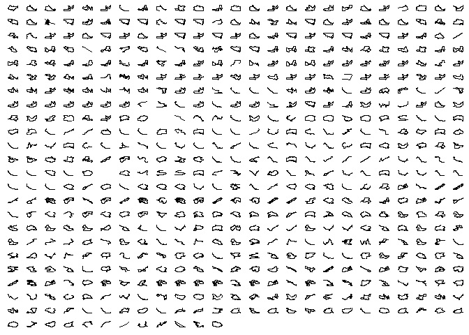

I am a vivid runner and cyclist. Since a few years, I’m recording almost
all my activities with some kind of GPS device.

I record my runs with a Garmin device and my bike rides with a Wahoo
device. Both accounts get synchronized with my Strava account. I figured
that it would be nice to directly access my data from my Strava account.

In the following text, I will describe the progress to get the data into
R. Once available in a nice format in R, the data is stored as a pin in
a private github repository. By doing so, the data is easily accessible
in other analysis or shiny apps.

In this analysis, the following packages are used:

    library(tarchetypes)
    library(conflicted)
    library(tidyverse)
    library(lubridate)
    library(jsonlite)
    library(targets)
    library(httr)
    library(pins)
    library(httr)
    library(fs)

    conflict_prefer("filter", "dplyr")

# Data

To get access to your Strava data from R, you have to create a Strava
api. How to do this is documented
[here](https://developers.strava.com/docs/getting-started/).

## OAuth Dance from R

The Strava api requires a so called OAuth dance. How this can be done
from within R is described in the following section.

Create an OAuth Strava app:

    define_strava_app <- function() {
      oauth_app(
        appname = "r_api",
        key = Sys.getenv("STRAVA_KEY"),
        secret = Sys.getenv("STRAVA_SECRET"))
    }

You can find your `STRAVA_KEY` and `STRAVA_SECRET` variables under the
Strava api settings after you have created your own personal api. The
name of api is determined during creation. In my case I named it
`r_api`.

Define an endpoint:

    define_strava_endpoint <- function() {
      oauth_endpoint(
        request = NULL,
        authorize = "https://www.strava.com/oauth/authorize",
        access = "https://www.strava.com/oauth/token")
    }

The `authorize` parameter describes the url to send client to for
authorization. And the `access` argument is used to exchange the
authenticated token.

The final authentication step. Before the user can execute the following
steps, he has to authenticate the api in the web browser.

    define_strava_sig <- function(endpoint, app) {
      oauth2.0_token(
        endpoint, app,
        scope = "activity:read_all,activity:read,profile:read_all",
        type = NULL, use_oob = FALSE, as_header = FALSE,
        use_basic_auth = FALSE, cache = FALSE)
    }

The information in `my_sig` can now be used to access Strava data.

## Activities

We are now authenticated and can directly access Strava data. At first
load an overview table of all available activities (one activity per
row). Because the total number of activities is unknown, use a while
loop. Break the execution of the loop, if there are no more activities
to read.

    read_all_activities <- function(sig) {
      activities_url <- parse_url(
        "https://www.strava.com/api/v3/athlete/activities")

      act_vec <- vector(mode = "list")
      df_act <- tibble::tibble(init = "init")
      i <- 1L

      while (nrow(df_act) != 0) {
        r <- activities_url %>%
          modify_url(
            query = list(
              access_token = sig$credentials$access_token[[1]],
              page = i)) %>%
          GET()

        df_act <- content(r, as = "text") %>%
          fromJSON(flatten = TRUE) %>%
          as_tibble()
        if (nrow(df_act) != 0)
          act_vec[[i]] <- df_act
        i <- i + 1L
      }

      df_activities <- act_vec %>%
        bind_rows() %>%
        mutate(start_date = ymd_hms(start_date))
    }

    ## # A tibble: 592 x 60
    ##    resource_state name  distance moving_time elapsed_time total_elevation~ type 
    ##             <int> <chr>    <dbl>       <int>        <int>            <dbl> <chr>
    ##  1              2 "Wee~  55641          9037        10610             923. Ride 
    ##  2              2 "Bre~  43892.         5594         5721             606  Ride 
    ##  3              2 "Rad~  18244.         3454        35536             300. Ride 
    ##  4              2 "Sta~  28529.         4214        11105             370  Ride 
    ##  5              2 "Abe~     26.5           3            3               0  Ride 
    ##  6              2 "Men~  32175.         9077        16895             996  Ride 
    ##  7              2 "Boz~  29377.         5411        12836             310  Ride 
    ##  8              2 "Mit~   8328          1173         1259              13  Ride 
    ##  9              2 "Fah~  36886.         5578        11141             468  Ride 
    ## 10              2 "Mor~   6552.         2693         2823             104. Run  
    ## # ... with 582 more rows, and 53 more variables: workout_type <int>, id <dbl>,
    ## #   external_id <chr>, upload_id <dbl>, start_date <dttm>,
    ## #   start_date_local <chr>, timezone <chr>, utc_offset <dbl>,
    ## #   start_latlng <list>, end_latlng <list>, location_city <lgl>,
    ## #   location_state <lgl>, location_country <chr>, start_latitude <dbl>,
    ## #   start_longitude <dbl>, achievement_count <int>, kudos_count <int>,
    ## #   comment_count <int>, athlete_count <int>, photo_count <int>, ...

Preprocess activities:

    pre_process_act <- function(df_act_raw, athlete_id) {
      df_act <- df_act_raw %>%
        mutate(
          across(contains("id"), as.character),
          `athlete.id` = athlete_id)
    }

## Measurements

Read the ‘stream’ data from Strava. A ‘stream’ is a nested list (json
format) with all available measurements of the corresponding activity.

To get all available variables and turn the result into a data frame,
define a helper function. This function takes an id of an activity and
an authentication token, which we have created earlier.

    read_activity_stream <- function(id, sig) {
      act_url <- parse_url(stringr::str_glue(
        "https://www.strava.com/api/v3/activities/{id}/streams"))
      access_token <- sig$credentials$access_token[[1]]

      r <- modify_url(
        act_url,
        query = list(
          access_token = access_token,
          keys = str_glue(
            "distance,time,latlng,altitude,velocity_smooth,heartrate,cadence,watts,
            temp,moving,grade_smooth"))) %>%
        GET()

      stop_for_status(r)

      fromJSON(content(r, as = "text"), flatten = TRUE) %>%
        as_tibble() %>%
        mutate(id = id)
    }

# Visualisation

Visualize the final data. Every facet is a activity and the color
represents the type.

    vis_meas <- function(df_meas_pro) {
      df_meas_pro %>%
        filter(!is.na(lat)) %>%
        ggplot(aes(x = lng, y = lat)) +
        geom_path() +
        facet_wrap(~ id, scales = "free") +
        theme(
          axis.line = element_blank(),
          axis.text.x = element_blank(),
          axis.text.y = element_blank(),
          axis.ticks = element_blank(),
          axis.title.x = element_blank(),
          axis.title.y = element_blank(),
          legend.position = "bottom",
          panel.background = element_blank(),
          panel.border = element_blank(),
          panel.grid.major = element_blank(),
          panel.grid.minor = element_blank(),
          plot.background = element_blank(),
          strip.text = element_blank())
    }

