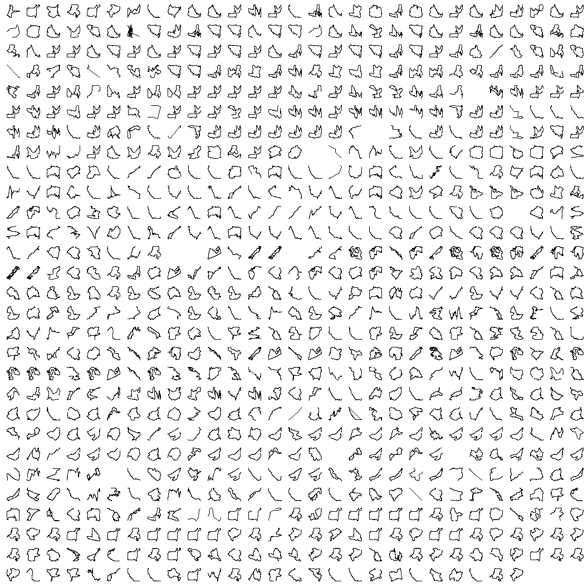

I am an avid runner and cyclist. For the past couple of years, I have
recorded almost all my activities on some kind of GPS device.

I record my runs with a Garmin device and my bike rides with a Wahoo
device, and I synchronize both accounts on Strava. I figured that it
would be nice to directly access my data from my Strava account.

In the following text, I will describe the progress to get Strava data
into R, process the data, and then create a visualization of activity
routes.

You will need the following packages:

    library(shinydashboard)
    library(reactablefmtr)
    library(tarchetypes)
    library(conflicted)
    library(reactable)
    library(tidyverse)
    library(lubridate)
    library(jsonlite)
    library(tsibble)
    library(shinyjs)
    library(targets)
    library(scales)
    library(plotly)
    library(httpuv)
    library(duckdb)
    library(shiny)
    library(httr2)
    library(arrow)
    library(pins)
    library(glue)
    library(fs)
    library(sf)

    conflict_prefer("filter", "dplyr")
    conflict_prefer("lag", "dplyr")

# Data

The whole data pipeline is implemented with the help of the `targets`
package. You can learn more about the package and its functionalities
[here](https://docs.ropensci.org/targets/).

In order to reproduce the analysis, perform the following steps:

-   Clone the repository: <https://github.com/duju211/pin_strava>
-   Install the packages listed in the `libraries.R` file
-   Run the target pipeline by executing `targets::tar_make()` command
-   Follow the instructions printed in the console

## Target Plan

We will go through the most important targets in detail.

## OAuth Dance from R

The Strava API requires an ‘OAuth dance’, described below.

### Create an OAuth Strava app

To get access to your Strava data from R, you must first create a Strava
API. The steps are documented on the [Strava Developer
site](https://developers.strava.com/docs/getting-started/). While
creating the app, you’ll have to give it a name. In my case, I named it
`r_api`.

After you have created your personal API, you can find your Client ID
and Client Secret variables in the [Strava API
settings](https://www.strava.com/settings/api). Save the Client ID as
STRAVA\_KEY and the Client Secret as STRAVA\_SECRET in your R
environment.

<aside>
You can edit your R environment by running `usethis::edit_r_environ()`,
saving the keys, and then restarting R.
</aside>

    STRAVA_KEY=<Client ID>
    STRAVA_SECRET=<Client Secret>

The information in `my_sig` can now be used to access Strava data. Set
the `cue_mode` of the target to ‘always’ so that the following API calls
are always executed with an up-to-date authorization token.

## Current authenticated user

Download information about the currently authenticated user. When
preprocessing the data, the columns shoes, clubs and bikes need special
attention, because they can contain multiple entries and can be
interpreted as list columns.

    active_user <- function(json_active_user, user_list_cols) {
      json_active_user[
        map_lgl(json_active_user, negate(is.null))
        & map_lgl(names(json_active_user), ~ !.x %in% user_list_cols)] |>
        as_tibble() |>
        mutate(id = as.character(id))
    }

In the end there is a data frame with one row for the currently
authenticated user.

## Activities

Load a data frame that gives an overview of all the activities from the
data. Because the total number of activities is unknown, use a while
loop. It will break the execution of the loop if there are no more
activities to read.

    read_all_activities <- function(access_token, active_user_id) {
      act_vec <- vector(mode = "list")
      df_act <- tibble(init = "init")
      i <- 1L

      while (nrow(df_act) != 0) {
        req <- request("https://www.strava.com/api/v3/athlete/activities") |>
          req_auth_bearer_token(token = access_token) |>
          req_url_query(page = i)

        resp <- req_perform(req)

        resp_check_status(resp)

        df_act <- resp |>
          resp_body_json(simplifyVector = TRUE) |>
          as_tibble()

        if (nrow(df_act) != 0)
          act_vec[[i]] <- df_act
        i <- i + 1L
      }

      act_vec |>
        bind_rows() |>
        mutate(
          start_date = ymd_hms(start_date),
          active_user_id = active_user_id,
          across(contains("id"), as.character))
    }

The resulting data frame consists of one row per activity. Make sure
that all ID columns have a character format and improve the column
names.

    ## # A tibble: 839 × 7
    ##    name   id    start_date              week distance total_elevation_gain type 
    ##    <chr>  <chr> <dttm>                <week>    <dbl>                <dbl> <chr>
    ##  1 "Fahr… 1015… 2023-11-04 12:24:35 2023 W44   17984.                 70.9 Ride 
    ##  2 "Zeit… 1014… 2023-11-01 09:50:16 2023 W44    5206.                132.  Run  
    ##  3 "Hard… 1011… 2023-10-27 15:20:42 2023 W43    6018.                127.  Run  
    ##  4 "11KM" 1009… 2023-10-24 16:15:44 2023 W43    4562.                 38.5 Run  
    ##  5 "Pick… 1005… 2023-10-16 14:52:57 2023 W42    4720.                121.  Run  
    ##  6 "Cicl… 1003… 2023-10-13 14:21:21 2023 W41   38116.                513   Ride 
    ##  7 "1210… 1002… 2023-10-12 17:16:59 2023 W41    4538.                 38.5 Run  
    ##  8 "Mona… 1001… 2023-10-10 15:54:22 2023 W41    4718                  84.1 Run  
    ##  9 "Mord… 9995… 2023-10-07 16:06:55 2023 W40    6101.                126.  Run  
    ## 10 "Hard… 9988… 2023-10-06 15:07:33 2023 W40    4904.                128.  Run  
    ## # ℹ 829 more rows

Extract ids of all activities. Exclude activities which were recorded
manually, because they don’t include additional data:

    rel_act_ids <- function(df_act_raw) {
      df_act_raw |>
        filter(!manual) |>
        pull(id)
    }

## Measurements

A ‘stream’ is a nested list (JSON format) with all available
measurements of the corresponding activity.

To get the available variables and turn the result into a data frame,
define a helper function `read_activity_stream`. This function takes an
ID of an activity and an authentication token, which you created
earlier.

Preprocess and unnest the data in this function. The column `latlng`
needs special attention, because it contains latitude and longitude
information. Separate the two measurements before unnesting all list
columns.

    read_activity_stream <- function(id, access_token) {
      req <- request("https://www.strava.com/api/v3/activities") |>
        req_auth_bearer_token(token = access_token) |>
        req_url_query(keys = str_glue(
          "distance,time,latlng,altitude,velocity_smooth,heartrate,cadence,",
          "watts,temp,moving,grade_smooth")) |>
        req_url_path_append(id) |>
        req_url_path_append("streams")

      resp <- req_perform(req)

      resp_check_status(resp)

      df_stream_raw <- resp |>
        resp_body_json(simplifyVector = TRUE) |>
        as_tibble() |>
        mutate(id = id) %>%
        pivot_wider(names_from = type, values_from = data)

      if ("latlng" %in% colnames(df_stream_raw)) {
        df_stream <- df_stream_raw %>%
          mutate(
            lat = map(
              .x = latlng, .f = ~ .x[, 1]),
            lng = map(
              .x = latlng, .f = ~ .x[, 2])) %>%
          select(-latlng)
      } else {
        df_stream <- df_stream_raw
      }

      df_stream %>%
        unnest(where(is_list)) %>%
        mutate(id = id)
    }

Do this for every id and save the resulting data frames as `feather`
file. By doing so we can later effectively query the data.

<aside>
The name of the board is determined by the currently logged in user and
will have a different name, if you run the pipeline.
</aside>

# Visualisation

Visualize the final data by displaying the geospatial information in the
data. Join all the activities into one data frame. To do this, get the
paths to all the measurement files:

    meas_paths <- function(board_name) {
      dir_ls(
        board_name, type = "file", regexp = "df_\\d.*\\.arrow$", recurse = TRUE)
    }

In the final plot every facet is one activity. Keep the rest of the plot
as minimal as possible.

    vis_meas <- function(df_meas) {
      df_meas |>
        ggplot(aes(x = lng, y = lat)) +
        geom_path() +
        facet_wrap(~ id, scales = "free") +
        theme(
          axis.line = element_blank(),
          axis.text.x = element_blank(),
          axis.text.y = element_blank(),
          axis.ticks = element_blank(),
          axis.title.x = element_blank(),
          axis.title.y = element_blank(),
          legend.position = "bottom",
          panel.background = element_blank(),
          panel.border = element_blank(),
          panel.grid.major = element_blank(),
          panel.grid.minor = element_blank(),
          plot.background = element_blank(),
          strip.text = element_blank())
    }

And there it is: All your Strava data in a few tidy data frames and a
nice-looking plot. Future updates to the data shouldn’t take too long,
because only measurements from new activities will be downloaded. With
all your Strava data up to date, there are a lot of appealing
possibilities for further data analyses of your fitness data.
